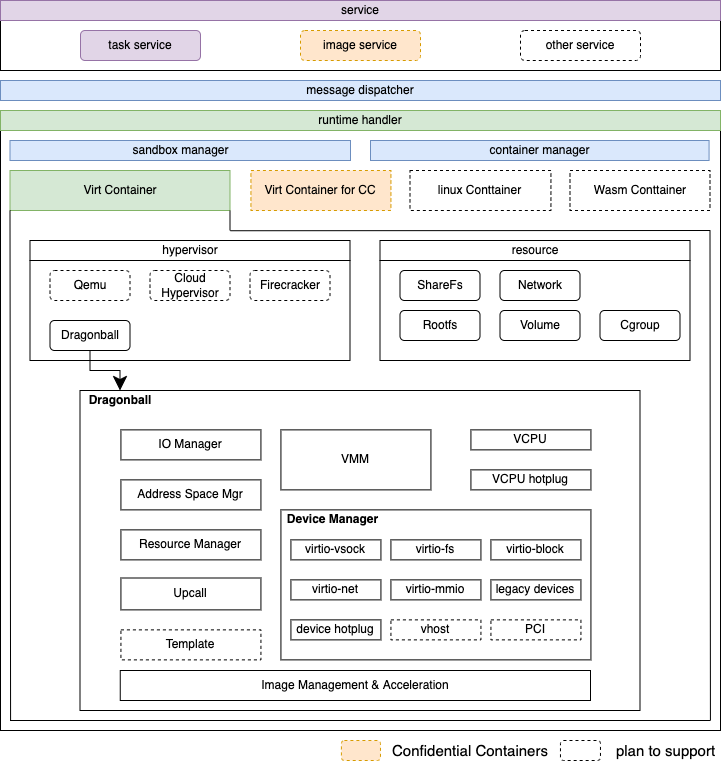
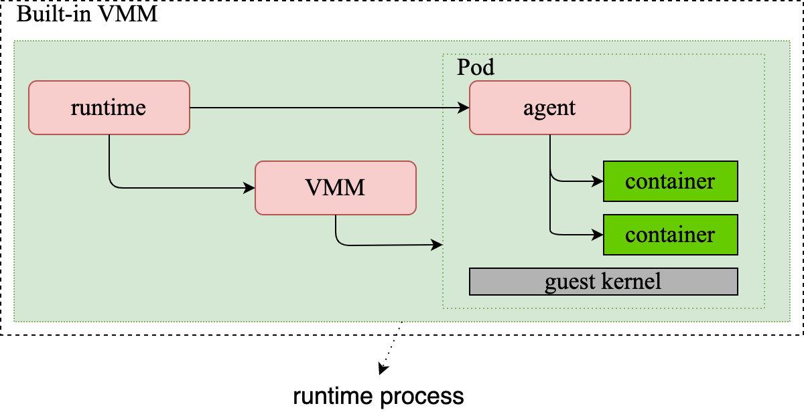

# Kata 3.0 Architecture
## Overview
In cloud-native scenarios, there is an increased demand for container startup speed, resource consumption, stability, and security. To achieve this, we would like to introduce you to a solid and secure Rust version kata-runtime. We chose Rust because it is designed to prevent developers from accidentally introducing flaws in their code that can lead to buffer overflows, missing pointer checks, integer range errors, or other memory-related vulnerabilities. Besides, in contrast to Go, Rust makes a variety of design trade-offs in order to obtain the fastest feasible execution performance.
Also, we provide the following designs:

- Turn key solution with builtin Dragonball Sandbox
- Async io to reduce resource consumption
- Extensible framework for multiple services, runtimes and hypervisors
- Lifecycle management for sandbox and container associated resources
## Design
### Architecture

### Built-in VMM
#### Why Need Built-in VMM

As shown in the figure, runtime and VMM are separate processes. The runtime process forks the VMM process and interacts through the inter-process RPC. Typically, process interaction consumes more resources than peers within the process, and it will result in relatively low efficiency. At the same time, the cost of resource operation and maintenance should be considered. For example, when performing resource recovery under abnormal conditions, the exception of any process must be detected by others and activate the appropriate resource recovery process. If there are additional processes, the recovery becomes even more difficult.
#### How To Support Built-in VMM
We provide Dragonball Sandbox to enable built-in VMM by integrating VMM's function into the Rust library. We could perform VMM-related functionalities by using the library. Because runtime and VMM  are in the same process, there is a benefit in terms of message processing speed and API synchronization. It can also guarantee the consistency of the runtime and the VMM life cycle, reducing resource recovery and exception handling maintenance, as shown in the figure:

### Async Support
#### Why Need Async
**Async is already in stable Rust and allows us to write async code**

- Async provides significantly reduced CPU and memory overhead, especially for workloads with a large amount of IO-bound tasks
- Async is zero-cost in Rust, which means that you only pay for what you use. Specifically, you can use async without heap allocations and dynamic dispatch, which greatly improves efficiency
- For more (see [Why Async?](https://rust-lang.github.io/async-book/01_getting_started/02_why_async.html) and [The State of Asynchronous Rust]https://rust-lang.github.io/async-book/01_getting_started/03_state_of_async_rust.html).

**There may be several problems if implementing kata-runtime with Sync Rust**

- Too many threads with a new TTRPC connection
   - TTRPC threads: reaper thread(1) + listener thread(1) + client handler(2)
- Add 3 I/O threads with a new container
- In Sync mode, implementing a timeout mechanism is challenging. For example, in TTRPC API interaction, the timeout mechanism is difficult to align with Golang
#### How To Support Async
The kata-runtime is controlled by TOKIO_RUNTIME_WORKER_THREADS to run the OS thread, which is 2 threads by default. For TTRPC and container-related threads run in the tokio thread in a unified manner, and related dependencies need to be switched to Async, such as Timer, File, Netlink, etc. With the help of Async, we can easily support no-block io and timer. Currently, we only utilize Async for kata-runtime. The built-in VMM keeps the OS thread because it can ensure that the threads are controllable.

**For N tokio worker threads and M containers**

- Sync runtime(both OS thread and tokio task are OS thread but without tokio worker thread)  OS thread number:  4 + 12*M
- Async runtime(only OS thread is OS thread) OS thread number: 2 + N
```shell
├─ main(OS thread)
├─ async-logger(OS thread)
└─ tokio worker(N * OS thread)
  ├─ agent log forwarder(1 * tokio task)
  ├─ health check thread(1 * tokio task)
  ├─ TTRPC reaper thread(M * tokio task)
  ├─ TTRPC listener thread(M * tokio task)
  ├─ TTRPC client handler thread(7 * M * tokio task)
  ├─ container stdin io thread(M * tokio task)
  ├─ container stdin io thread(M * tokio task)
  └─ container stdin io thread(M * tokio task)
```
### Extensible Framework
The Rust version kata-runtime is designed with the extension of service, runtime, and hypervisor, combined with configuration to meet the needs of different scenarios. At present, the service provides a register mechanism to support multiple services. Services could interact with runtime through messages. In addition, the runtime handler handles messages from services. To meet the needs of a binary that supports multiple runtimes and hypervisors, the startup must obtain the runtime handler type and hypervisor type through configuration.


### Resource Manager
In our case, there will be a variety of resources, and every resource has several subtypes. Especially for Virt-Container, every subtype of resource has different operations. And there may be dependencies, such as the share-fs rootfs and the share-fs volume will use share-fs resources to share files to the VM. Currently, network and share-fs are regarded as sandbox resources, while rootfs, volume, and cgroup are regarded as container resources. Also, we abstract a common interface for each resource and use subclass operations to evaluate the differences between different subtypes.


## Roadmap

- Stage 1: provide basic features（current delivered）
- Stage 2: support common features
- Stage 3: support full features

| **Class** | **Sub-Class** | **Development Stage** |
| --- | --- | --- |
| service | task service | Stage 1 |
|  | extend service | Stage 3 |
|  | image service | Stage 3 |
| runtime handler | Virt-Container | Stage 1 |
|  | Wasm-Container | Stage 3 |
|  | Linux-Container | Stage 3 |
| Endpoint | Veth Endpoint | Stage 1 |
|  | Physical Endpoint | Stage 2 |
|  | Tap Endpoint | Stage 2 |
|  | Tuntap Endpoint | Stage 2 |
|  | IPVlan Endpoint | Stage 3 |
|  | MacVlan Endpoint | Stage 3 |
|  | MacVtap Endpoint | Stage 3 |
|  | VhostUserEndpoint | Stage 3 |
| Network Interworking Model | Tc filter | Stage 1 |
|  | Route | Stage 1 |
|  | MacVtap | Stage 3 |
| Storage | virtiofs | Stage 1 |
|  | nydus | Stage 2 |
| hypervisor | Dragonball | Stage 1 |
|  | Qemu | Stage 2 |
|  | Acrn | Stage 3 |
|  | CloudHypervisor | Stage 3 |
|  | Firecracker | Stage 3 |
